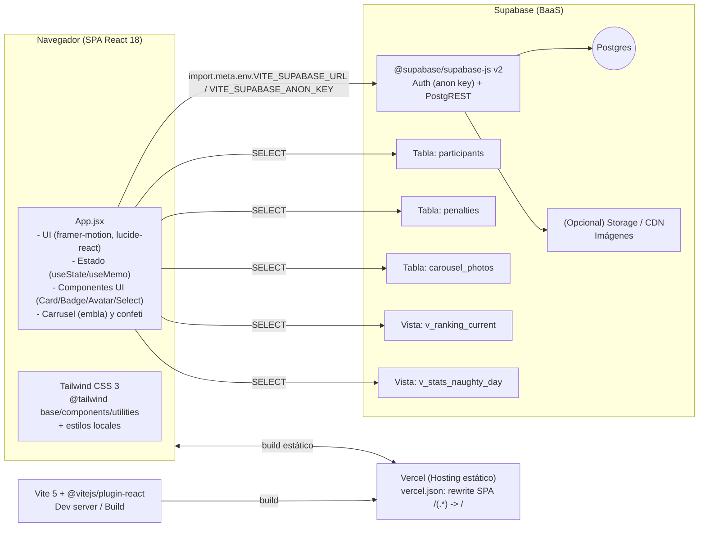
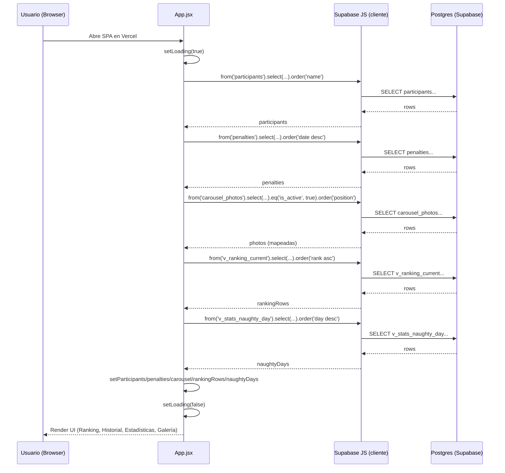

# ⚽ Liga Jimmy Fantasy – Versión atractiva (dark mode + confeti + carrusel)

## Requisitos
- Node 18+
- Variables `.env`:
```
VITE_SUPABASE_URL=...
VITE_SUPABASE_ANON_KEY=...
```

## Instalar y ejecutar
```bash
npm install
npm run dev
```

## Despliegue (Vercel)
- Añade las env vars en Vercel (Production & Preview).
- `npm run build` genera `dist` automáticamente.

## Flujo de contribución (ramas y PR)
- Trabaja siempre en ramas a partir de `main` (por ejemplo, `feat/<breve-descripcion>` o `fix/<breve-descripcion>`).
- Usa Conventional Commits en los mensajes de commit.
- Abre un Pull Request hacia `main` usando la plantilla del repositorio.
- Revisa el documento de contribución para más detalles: [CONTRIBUTING.md](./CONTRIBUTING.md)

## Incluye
- Tema oscuro con toggle y persistencia en localStorage
- Cabecera con gradiente y efecto glass
- Tarjetas con “float hover”
- Confeti (botón y easter egg Konami)
- Carrusel de fotos (usa `participants.photo_url`)
- Tabla responsive con scroll horizontal

## Variables de entorno
Añade estas variables en `.env` (local) y en Vercel (Production & Preview):

```env
VITE_SUPABASE_URL=<url_del_proyecto_supabase>
VITE_SUPABASE_ANON_KEY=<anon_key_supabase>
# Opcional: URL pública del PDF de normativa para botón de descarga en `Rules`
VITE_RULES_PDF_URL=<url_pdf_normativa_opcional>
```

## Arquitectura


## Secuencia de carga de datos

